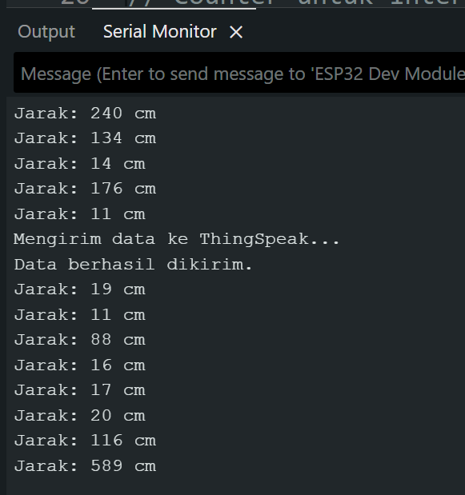
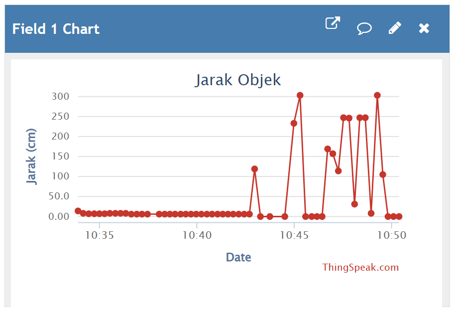
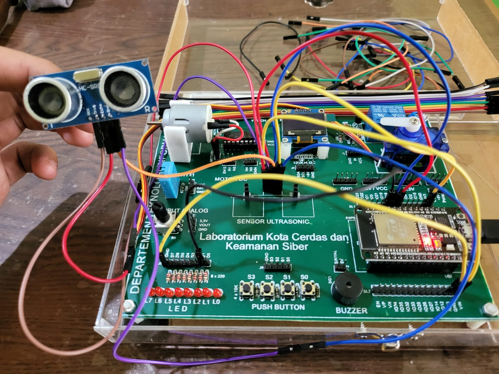

# Laporan Tugas IoT
## Sensor Jarak dengan Notifikasi LED dan Monitoring via ThingSpeak
Proyek ini berfungsi untuk mendeteksi jarak menggunakan sensor ultrasonik HC-SR04 yang dikontrol oleh ESP32. Jika jarak objek yang terdeteksi kurang dari 10 cm, sistem akan memberikan peringatan visual berupa kedipan LED merah. Seluruh data pengukuran jarak dikirim secara real-time (tiap 15 detik) ke platform ThingSpeak untuk monitoring.

## 👥 Anggota Kelompok

| No | Nama                   | NRP         |
|----|------------------------|-------------|
| 1  | Imam Mahmud Dalil Fauzan     | 5027241100 |
| 2  | Christiano Ronaldo Silalahi| 5027241025         |

## ⚙️ Komponen yang Digunakan
1. ESP32 Development Board: Sebagai otak dari sistem.
2. Sensor Ultrasonik HC-SR04: Untuk mengukur jarak.
3. LED 5mm (Merah): Sebagai indikator peringatan visual.
4. Resistor 220Ω: Untuk membatasi arus ke LED.
6. Kabel Female-to-Female.
7. Kabel Male-to-Female.

## 🛠️ Langkah-langkah
1. Pemasangan Komponen (Wiring)

    | Komponen          | Pin Komponen | Terhubung ke Pin ESP32 | Keterangan                 |
    | :---------------- | :----------- | :--------------------- | :------------------------- |
    | **Sensor Ultrasonik** | `VCC` /  `5V`  | `VIN` / `5V`             | Sumber daya                |
    |                   | `GND`        | `GND`                  | Ground                     |
    |                   | `Trig`       | `GPIO 5`               | Pin Trigger                |
    |                   | `Echo`       | `GPIO 18`              | Pin Echo                   |
    | **LED Merah** | Anoda (+)    | `GPIO 19`              | (Melalui Resistor 220Ω)    |
    |                   | Katoda (-)   | `GND`                  | Ground                     |

2. Persiapan Software

    Sebelum mengunggah kode, pastikan Arduino IDE sudah siap dengan menginstal *library* yang dibutuhkan.
3. Buka Arduino IDE, lalu masuk ke **Sketch > Include Library > Manage Libraries...**.
4. Cari dan instal *library* `ThingSpeak` by MathWorks

5. Konfigurasi ThingSpeak
6. Buat Akun: Daftar atau masuk ke [ThingSpeak.com](https://thingspeak.com/).
7. Buat Channel Baru:
    - Klik **Channels > My Channels > New Channel**.
    - Beri nama channel (misal: "Monitoring Jarak ESP32").
    - Beri nama **Field 1** menjadi "Jarak (cm)".
    - Simpan Channel.
8. Ambil API Keys:
    - Masuk ke tab **API Keys** di dalam channel yang baru dibuat.
    - Salin **Channel ID** dan **Write API Key**. Dua nilai ini akan dimasukkan ke dalam kode Arduino.

## 🌐 Kode Program
Salin kode di bawah ini ke Arduino IDE. Jangan lupa untuk mengganti placeholder untuk WiFi dan ThingSpeak dengan data anda.

```cpp
#include <WiFi.h>
#include "ThingSpeak.h"

// --- Pengaturan Perangkat Keras ---
const int trigPin = 5;
const int echoPin = 18;
const int ledPin = 19;

// --- GANTI DENGAN DATA MILIKMU ---
const char* ssid = "NAMA_WIFI_KAMU";
const char* password = "PASSWORD_WIFI_KAMU";
unsigned long myChannelNumber = 0; // Masukkan Channel ID ThingSpeak
const char * myWriteAPIKey = "API_KEY_KAMU"; // Masukkan Write API Key

// Inisialisasi klien WiFi dan variabel
WiFiClient client;
long duration;
int distance;
int thingSpeakCounter = 0;

void setup() {
  Serial.begin(115200);
  pinMode(trigPin, OUTPUT);
  pinMode(echoPin, INPUT);
  pinMode(ledPin, OUTPUT);

  // Koneksi ke WiFi
  Serial.print("Menghubungkan ke WiFi...");
  WiFi.begin(ssid, password);
  while (WiFi.status() != WL_CONNECTED) {
    delay(500);
    Serial.print(".");
  }
  Serial.println("\nWiFi terhubung!");

  ThingSpeak.begin(client);
}

void loop() {
  // Mengukur Jarak
  digitalWrite(trigPin, LOW);
  delayMicroseconds(2);
  digitalWrite(trigPin, HIGH);
  delayMicroseconds(10);
  digitalWrite(trigPin, LOW);
  duration = pulseIn(echoPin, HIGH);
  distance = duration * 0.034 / 2;

  // Menampilkan output ke terminal setiap 0,5 detik
  Serial.print("Jarak: ");
  Serial.print(distance);
  Serial.println(" cm");

  // Logika LED Peringatan
  if (distance < 10 && distance > 0) {
    digitalWrite(ledPin, HIGH); // LED menyala jika jarak dekat
  } else {
    digitalWrite(ledPin, LOW); // LED mati jika jarak aman
  }

  // Counter untuk interval pengiriman data ke ThingSpeak
  thingSpeakCounter++;

  // Kirim data setiap 30 kali loop (30 * 0.5 detik = 15 detik)
  if (thingSpeakCounter >= 30) {
    Serial.println("Mengirim data ke ThingSpeak...");
    int httpCode = ThingSpeak.writeField(myChannelNumber, 1, distance, myWriteAPIKey);

    if (httpCode == 200) {
      Serial.println("Data berhasil dikirim.");
    } else {
      Serial.println("Gagal mengirim data. Kode Error: " + String(httpCode));
    }
    thingSpeakCounter = 0; // Reset counter
  }

  // Interval loop utama
  delay(500);
}
```
[File Kode Program (code.ino)](src/code.ino)
## 📷 Dokumentasi
1. **Output di Terminal**

   

2. **Output di ThingSpeak**
   
   

3. **Dokumentasi Fisik**
   
   
